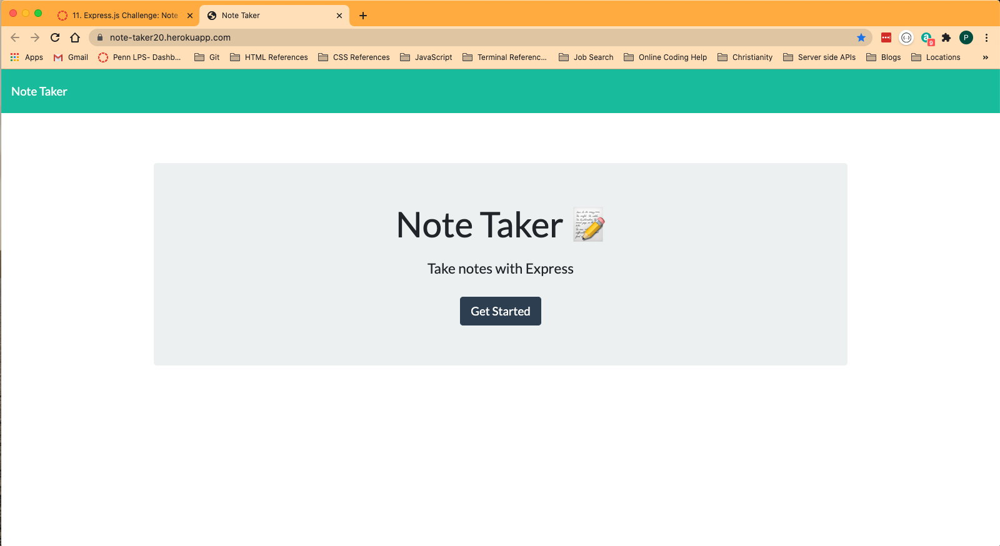
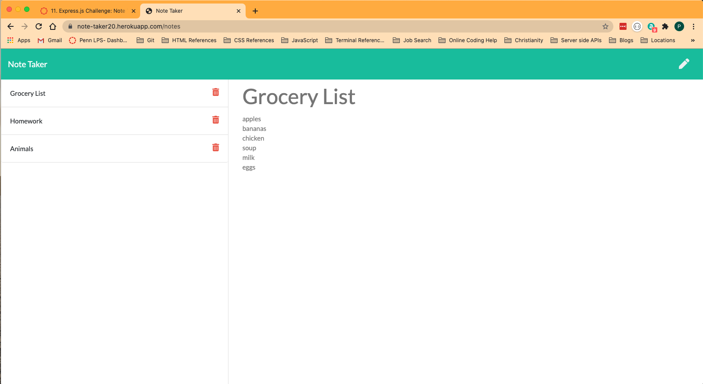

  # Note Taker

  
  
  ## Description
  This application is deployed through Heroku. It is an application that will allow users to write notes about anything they want! Each note that is entered will be stored and saved in the backend server. 

  ## Table of Contents

  * [Usage](#usage)
  * [Credits](#credits)
  * [License](#license)
  * [Questions](#questions)
  
  
  ## Usage
  All you need to do is go to <https://note-taker20.herokuapp.com/>. This will take you to the Note Taker's homepage, then you will click the "get started" button and that will direct you to a page to be able to enter a Note Title, and then the body of the note that you want to add. When you type in a title, and then the body of the note, a save icon will appear in the top right of the page. When you are done typing in the body of the note then all you have to do is click the save icon and then you will be able to see the saved notes to the left of the page and will be able to add a new note in the column to the right. 
  
  >  
    
  
  ## License
  MIT  

  ## Questions
  If you have any questions you can visit my github profile at <https://github.com/pschlafley>
  or you can email me at <pschlafley0@gmail.com>

  ## Links
  Here is a link to a video that demonstrates the project 
  * [Note Taker repo](https://github.com/pschlafley/Note-Taker)
  * [live deployed site on heroku](https://note-taker20.herokuapp.com/)